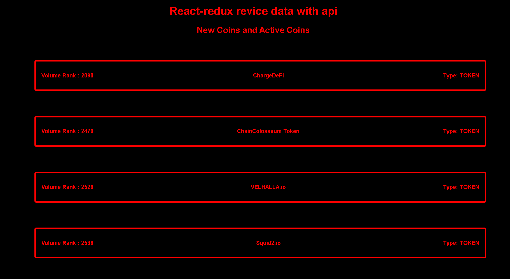

# New Coins and Active Coins List




**This is my react project 
**First of all I used react and redux
**Project will create a list for new coins and active's coins


## Built With

-Html
-Css
-React
-JavaScript
-Redux
-API
## Live Demo

[Live Demo Link]


## Getting Started

** I have a action and one reducers
** I checked with reducers come from API
** I have one if condition for check coins

**To get a copy of this repo into your local machine run the following command:**
```
git clone https://github.com/AtillaTahak/new_coin_list.git
- cd new_coin_list
- npm install
- npm start
in visual studio code you can click the go live button to view it live in the browser.
```

## Authors

👤 **ATİLLA TAHA KÖRDÜĞÜM**

- GitHub: [@AtillaTahak](https://github.com/AtillaTahak)
- Twitter: [@AtillaTahaa](https://twitter.com/AtillaTahaa)
- LinkedIn: [LinkedIn](https://www.linkedin.com/in/atilla-taha-kördüğüm-a93702186/)
- Blog: [Blog](atillataha.blogspot.com)
- Youtube: [YouTube](https://www.youtube.com/channel/UCmoD0x4Z9vdG2PCsI5p8FYg)

## Acknowledgments
-Thanks to Microverse
## 📝 License

This project is [MIT](./MIT.md) licensed.
